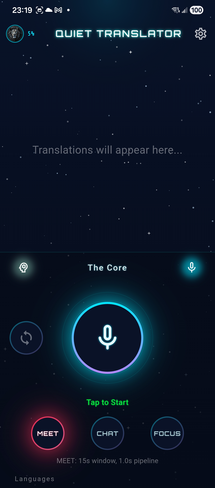
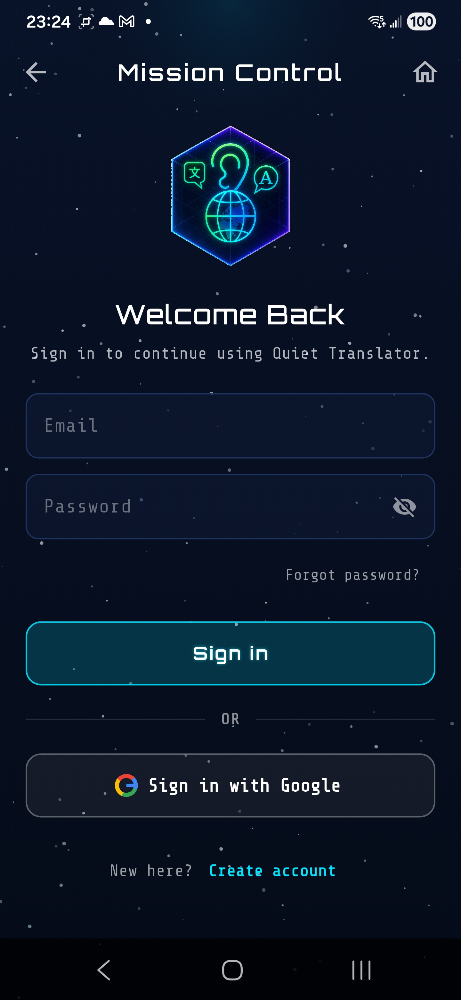
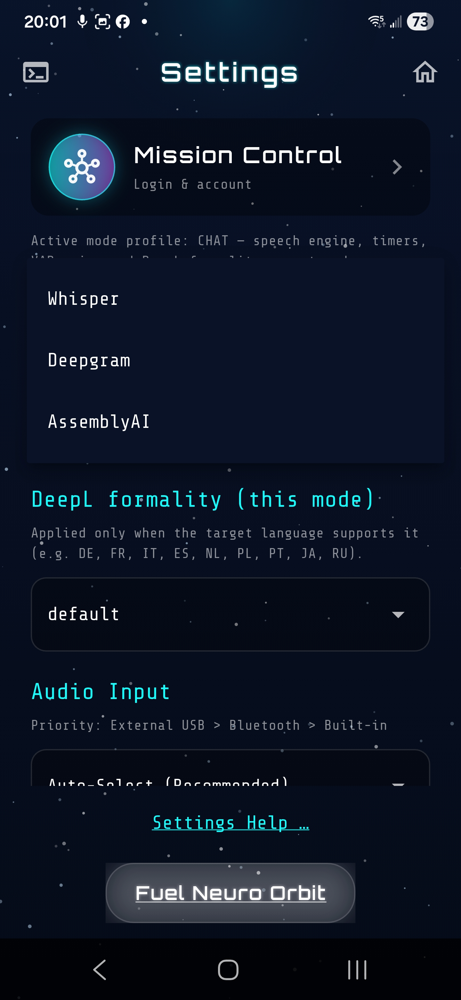
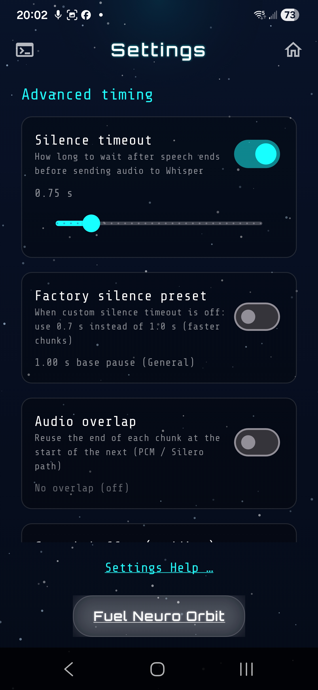

# 🦁 AI Quiet Translator

*Real-time AI voice translation pipeline designed specifically for high-noise industrial and assembly environments.*

  

## 🎯 The Problem
In industrial environments, heavy machinery and ambient noise make communication between team members difficult. Traditional translation apps fail because their standard Bluetooth and microphone configurations cannot isolate voice from industrial noise, and waiting for full-sentence translation causes unacceptable delays on the floor.

## 💡 The Solution
**Quiet Translator** uses a custom two-phase audio pipeline and forced microphone routing to ensure seamless communication. Users can speak directly into the device's main microphone (bypassing low-quality Bluetooth headset mics) while receiving instant, translated audio feedback directly into their earpieces.

## 📱 Screenshots (UI Showcase)

  
  
  
  

## 🛠 Architecture & Tech Stack

* **Frontend:** Flutter, Dart
* **Backend / Proxy:** AWS Serverless (API Gateway, AWS Lambda), Node.js
* **Speech-to-Text (STT):** Deepgram / AssemblyAI via WebSockets
* **Translation:** DeepL API
* **Security:** JWT Token generation, Custom Headers, Obfuscated compiled binaries
